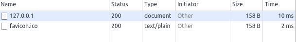
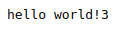

# NodeJS笔记

## 问题#1

```js
var http = require("http");
var i = 0;
http.createServer(function(request,response){
    response.writeHead(200,{"Content-Type":"text/plain"});
    response.write("hello world!" + i++ );
    response.end();
}).listen(9000);
```

|图片1|图片2|图片3
|:---|:---|:---|
||

- 一次刷实运行了两次，因为浏览器默认一次会请求favicon.ico，如果这不符合我们的业务逻辑，就可以通过解析url，当请求ico时不做逻辑处理。

```js
var http = require("http");
var url = require("url");
var i = 0;
http.createServer(function(request,response){
    response.writeHead(200,{"Content-Type":"text/plain"});
    if(url.parse(request.url).path == '/favicon.ico')
        return;
        response.write("hello world!" + i++ );
        response.end();
}).listen(9000);
```
|图片1|图片2
|:---|:---|
|